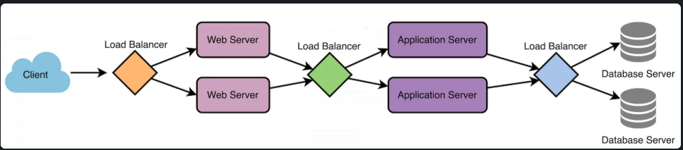
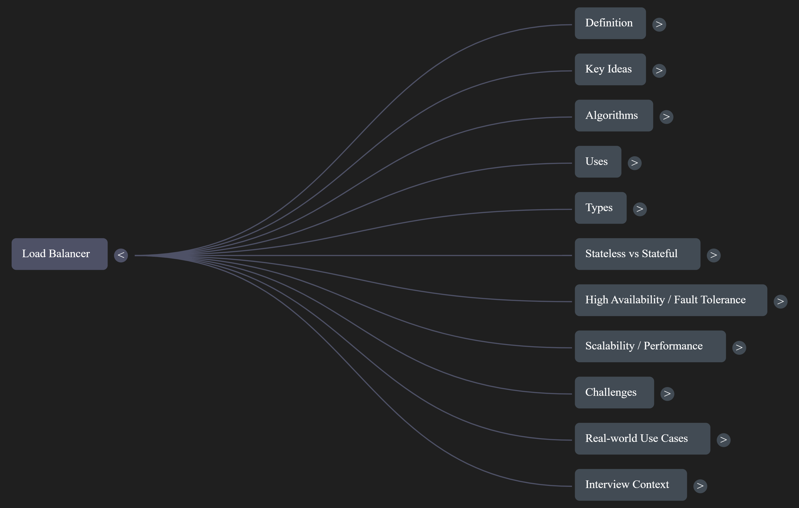

# Introduction to Load Balancing

Load balancing is a crucial component of System Design, as it helps distribute incoming requests and traffic evenly across multiple servers. The main goal of load balancing is to ensure high availability, reliability, and performance by avoiding overloading a single server and preventing downtime.

## Definition and Purpose

Typically, a load balancer sits between the client and the server, accepting incoming network and application traffic and distributing this traffic across multiple backend servers using various algorithms. By balancing application requests across multiple servers, a load balancer:

- Reduces the load on individual servers
- Prevents any single server from becoming a point of failure
- Improves overall application availability and responsiveness
- Enables horizontal scaling of applications

## Load Balancer Placement

To utilize full scalability and redundancy, we can implement load balancing at multiple layers of the system:

Load balancers can be placed at three critical points:

1. **Between the user and the web server** - Distributes client requests across web servers
2. **Between web servers and an internal platform layer** - Balances load between web servers and application servers or cache servers
3. **Between internal platform layer and database** - Ensures database queries are evenly distributed

## Key Terminology and Concepts

- **Load Balancer**: A device or software that distributes network traffic across multiple servers based on predefined rules or algorithms.
- **Backend Servers**: The servers that receive and process requests forwarded by the load balancer. Also referred to as the server pool or server farm.
- **Load Balancing Algorithm**: The method used by the load balancer to determine how to distribute incoming traffic among the backend servers.
- **Health Checks**: Periodic tests performed by the load balancer to determine the availability and performance of backend servers. Unhealthy servers are removed from the server pool until they recover.
- **Session Persistence**: A technique used to ensure that subsequent requests from the same client are directed to the same backend server, maintaining session state and providing a consistent user experience.
- **SSL/TLS Termination**: The process of decrypting SSL/TLS-encrypted traffic at the load balancer level, offloading the decryption burden from backend servers and allowing for centralized SSL/TLS management.

## How Load Balancers Work

Load balancers work by distributing incoming network traffic across multiple servers or resources to ensure efficient utilization of computing resources and prevent overload. Here are the general steps:

1. The load balancer receives a request from a client or user.
2. The load balancer evaluates the incoming request and determines which server should handle it based on a predefined algorithm.
3. The load balancer forwards the incoming traffic to the selected server.
4. The server processes the request and sends a response back to the load balancer.
5. The load balancer receives the response and forwards it to the client who made the request.

This process takes into account factors such as:
- Server capacity
- Server response time
- Number of active connections
- Geographic location
- Current load on each server
