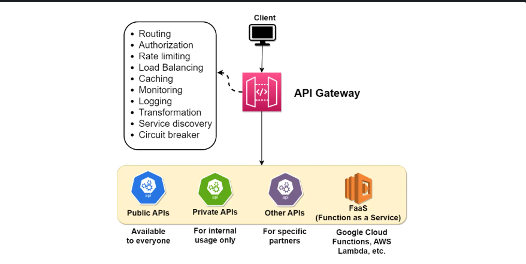
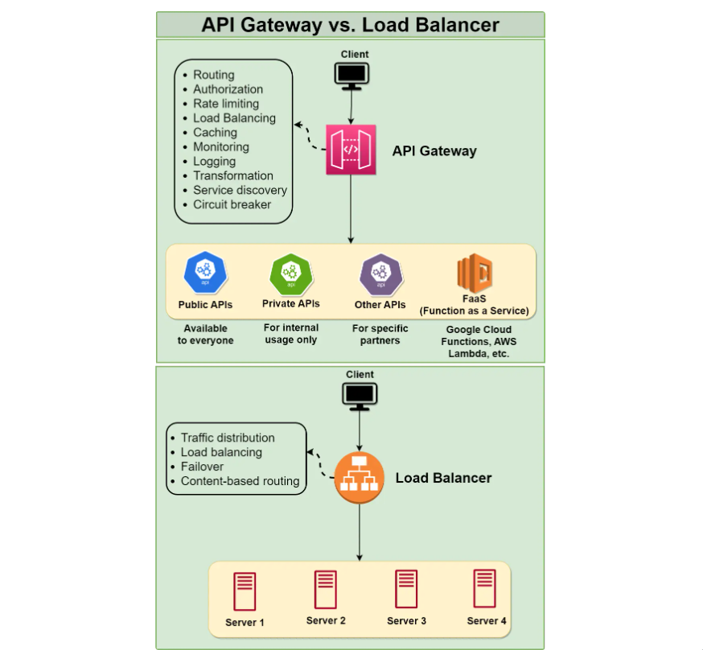

# Introduction to API Gateway

## What is an API Gateway?
An API Gateway is a server-side architectural component that acts as an intermediary between clients (such as web browsers, mobile apps, or other services) and backend services, microservices, or APIs. It provides a single entry point for external consumers to access the services and functionalities of the backend system.

### Core Responsibilities
- **Request Routing:** Directs client requests to the appropriate microservice.
- **Authentication & Authorization:** Verifies user identity and permissions.
- **Rate Limiting:** Prevents abuse through request throttling.
- **Protocol Translation:** Converts between different protocols as needed.
- **Response Aggregation:** Combines multiple backend responses.
- **Caching:** Stores responses to improve performance.
- **Monitoring:** Tracks API usage and performance metrics.

This centralized approach allows microservices to focus on their specific business tasks while the gateway handles cross-cutting concerns.

## API Gateway vs. Load Balancer
While both components sit between clients and services, they serve different purposes:

### Key Differences
| Feature | API Gateway | Load Balancer |
|---------|-------------|---------------|
| **Primary Focus** | Request routing based on content/path | Even distribution of traffic |
| **Request Processing** | Content-aware routing, transformation | Usually content-agnostic distribution |
| **Functionality** | Rich feature set (auth, rate limiting, etc.) | Primarily focused on availability and scaling |
| **Request Types** | Routes based on API endpoints and URL paths | Routes based on server health and load |
| **Typical Use Case** | Managing access to microservices ecosystem | Distributing load across identical instances |

### Traffic Handling
- **API Gateway:** Routes requests based on specific API endpoints to appropriate services.
- **Load Balancer:** Distributes requests sent to a single endpoint across multiple identical backend servers based on factors like server performance and availability.

In modern architectures, both components are often used together. Load balancers ensure high availability of the API Gateway itself, while the gateway manages the complexity of the microservice architecture.
