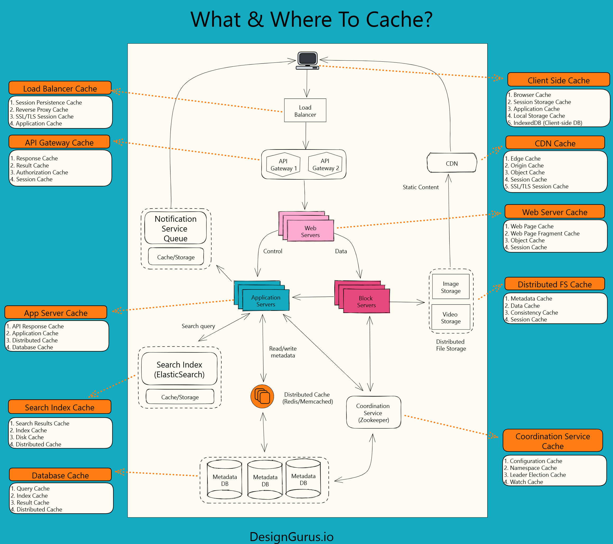

# Types of Caching

## 🔍 Definition
> Caching strategies that differ in location, implementation, and purpose, each optimizing performance for specific scenarios by storing frequently accessed data in different layers of the system architecture.

## 🧠 Key Ideas
- Different caching approaches serve distinct purposes in the system architecture
- Caching can be implemented at multiple levels: client, network, server, database
- The choice of caching type depends on data size, access patterns, and consistency requirements
- Each caching type offers different trade-offs in terms of speed, capacity, and complexity
- Implementing multiple cache types in layers often provides the best overall system performance
## Major Types of Caching

### 1. In-Memory Caching
- **Description**: Stores data in RAM for ultra-fast access
  In-memory caching places frequently accessed data directly in the server's RAM, eliminating the need for disk I/O operations. By keeping data in memory, access times drop from milliseconds (disk) to microseconds or nanoseconds (RAM). This type of cache is typically implemented using dedicated memory caching systems. When an application needs data, it first checks the in-memory cache before making expensive database queries or API calls. The cache is typically distributed across multiple nodes in a cluster to provide both scalability and redundancy.
- **Use Cases**: API responses, session data, computed results
- **Technologies**: Redis, Memcached, Hazelcast
- **Advantages**: Extremely fast access (microseconds), supports complex data structures
- **Limitations**: Memory size constraints, volatility (data lost on restart)

### 2. Disk Caching
- **Description**: Stores cached data on SSDs or HDDs
  Disk caching persists cached data to the file system, either on traditional hard drives or SSDs. This approach serves as an intermediate layer between memory and the original data source. Disk caches are typically larger than memory caches and survive system restarts, making them suitable for larger datasets that need persistence. Content is often stored in an optimized format for quick retrieval, and metadata is maintained to track cache freshness. Disk caching is commonly used in web servers, browsers, and content delivery systems to store larger files like images, videos, and documents.
- **Use Cases**: Larger datasets, data that should persist between restarts
- **Technologies**: Varnish, Squid, browser disk cache
- **Advantages**: Larger capacity than memory, persistence across restarts
- **Limitations**: Slower than memory caching (milliseconds vs. microseconds)

### 3. Database Caching
- **Description**: Optimization techniques within database systems
  Database caching encompasses various techniques used by database management systems to optimize query performance. This includes query result caches (storing results of frequently executed queries), buffer pools (keeping frequently accessed database pages in memory), and materialized views (pre-computing and storing the results of complex queries). Most modern databases implement multiple internal caching mechanisms that work transparently to the user. Additionally, external database caching layers can be implemented using dedicated caching systems that sit between the application and the database.
- **Use Cases**: Query results, computed aggregations, frequently accessed records
- **Technologies**: PostgreSQL PGQA, MySQL Query Cache, Redis as a database cache
- **Advantages**: Reduces database load, improves query response time
- **Limitations**: Can become inconsistent with underlying data, requires careful invalidation

### 4. Client-Side Caching
- **Description**: Storing data on end-user devices
  Client-side caching stores data directly on the user's device, either in the browser or within a mobile application. This approach eliminates network round trips for previously accessed content, dramatically improving perceived performance and reducing server load. Modern browsers implement sophisticated caching mechanisms for web resources, controlled through HTTP headers. Web applications can also explicitly cache data using APIs like localStorage, sessionStorage, and IndexedDB. Mobile applications implement similar caching strategies for offline functionality and performance optimization.
- **Use Cases**: Web assets (JS/CSS/images), offline functionality, user preferences
- **Technologies**: Browser cache, localStorage, IndexedDB, mobile app caching
- **Advantages**: Reduces network requests, improves perceived performance, enables offline use
- **Limitations**: Limited control over eviction, security concerns, device storage constraints

### 5. Server-Side Caching
- **Description**: Caching on application servers to avoid recomputation
  Server-side caching stores computed results, rendered templates, or frequently accessed data directly on application servers. This approach prevents repeated computation or database access for similar requests. The cache can be local to each server instance or shared across a server farm using a distributed caching solution. Common implementations include page caching (storing entire rendered HTML pages), fragment caching (storing portions of rendered pages), and data caching (storing the results of expensive operations or database queries). Server-side caching is typically implemented within the application framework or via middleware.
- **Use Cases**: HTML fragments, API responses, rendered templates
- **Technologies**: Application frameworks (Rails, Django, Laravel), reverse proxies
- **Advantages**: Reduces application server load, improves response time
- **Limitations**: Increases memory usage on application servers, can be complex to invalidate

### 6. CDN Caching
- **Description**: Globally distributed cache servers that store content close to users
  Content Delivery Network (CDN) caching distributes content across a global network of edge servers, placing data physically closer to end users. When a user requests content, the request is routed to the nearest edge server rather than to the origin server, significantly reducing latency. CDNs typically cache static assets but can also cache dynamic content with appropriate configuration. Modern CDNs provide additional features like automatic compression, image optimization, and security benefits like DDoS protection. CDN caching is especially important for global applications with users distributed across different geographic regions.
- **Use Cases**: Static assets, media files, API responses, static web pages
- **Technologies**: Cloudflare, Akamai, Amazon CloudFront, Fastly
- **Advantages**: Reduces latency for global users, offloads origin servers, DDoS protection
- **Limitations**: Complex invalidation, additional cost, limited control over edge behavior

### 7. DNS Caching
- **Description**: Storing DNS resolution results to avoid repeated lookups
  DNS caching stores the results of domain name to IP address resolutions to avoid repeatedly querying DNS servers. This caching occurs at multiple levels: in the operating system, in browsers, in routers, and within the DNS infrastructure itself. By caching DNS query results, systems can reduce lookup latency (often saving hundreds of milliseconds) and decrease the load on DNS servers. DNS records have a Time-to-Live (TTL) value that determines how long resolvers should cache the result before performing a fresh lookup, allowing administrators to balance performance against how quickly DNS changes propagate.
- **Use Cases**: Any system that requires hostname resolution
- **Technologies**: Browser DNS cache, OS-level DNS cache, DNS server caches
- **Advantages**: Reduces DNS lookup latency, decreases load on DNS servers
- **Limitations**: Can lead to stale DNS records, limited control over TTL in some environments

## 📊 Real-world Use Case
**Amazon.com** implements multiple caching layers to deliver fast shopping experiences:
- **Browser Caching**: Static assets (images, CSS) stored in shoppers' browsers
- **CDN Caching**: Product images and static content cached at edge locations worldwide via CloudFront
- **API Gateway Caching**: Repeat API requests cached to reduce backend load
- **Application Caching**: User sessions and shopping cart data in ElastiCache (Redis)
- **Database Caching**: Product catalog and inventory data cached using DAX (DynamoDB Accelerator)
- This multi-tiered approach allows Amazon to serve millions of unique products to millions of customers with millisecond response times.

## 📈 Diagram
```
┌─────────────────┐   ┌─────────────────┐   ┌─────────────────┐   ┌─────────────────┐
│                 │   │                 │   │                 │   │                 │
│   Client-side   │◄─►│  CDN Caching    │◄─►│   Server-side   │◄─►│    Database     │
│    Caching      │   │                 │   │    Caching      │   │    Caching      │
│                 │   │                 │   │                 │   │                 │
└─────────────────┘   └─────────────────┘   └─────────────────┘   └─────────────────┘
      Browser              Network             Application           Data Storage
     Fast access       Geographic reach       Computation           Query results
```

# 📦 What & Where to Cache – A Journey Through Caching Layers


> Diagram credit: [DesignGurus.io](https://designgurus.io/)


It’s based on the "What & Where to Cache?" diagram (by DesignGurus.io) and provides context for each layer.

---

## 🧭 1. Client-Side Cache – The First Line of Defense

The user’s browser is the very first place where caching occurs.

**Examples:**
- **Browser Cache**: Previously loaded CSS, JS, images
- **Session Storage / Local Storage**: Auth tokens, temporary state
- **IndexedDB**: Offline data, user preferences

✅ *Reduces network requests and improves perceived performance*  
❌ *Limited control and security concerns*

---

## 🚦 2. Load Balancer & API Gateway Cache – Routing with Intelligence

### **Load Balancer Cache**
- **Session Persistence Cache** (sticky sessions)
- **Reverse Proxy Cache**
- **SSL/TLS Session Cache**

### **API Gateway Cache**
- **Response Cache**: Stores responses to repeat API calls
- **Authorization Cache**: Caches auth checks
- **Session Cache**

✅ *Reduces backend load for authentication and idempotent requests*

---

## 🛰️ 3. CDN Cache – Global Static Content Delivery

**Types of CDN Caches:**
- **Edge Cache**: Closest to the user
- **Origin/Object Cache**: Caches responses from the origin server
- **Session and TLS Cache**

✅ *Delivers static content (HTML, CSS, JS, images, videos) fast across the globe*  
❌ *Limited control over cache invalidation policies*

---

## 🖥️ 4. Web Server & App Server Cache – Optimizing Dynamic Responses

### **Web Server Cache**
- **Web Page & Fragment Cache**: Pre-rendered or templated HTML
- **Object and Session Cache**

### **App Server Cache**
- **API Response Cache**
- **Application-level Cache**
- **Distributed Cache**
- **Database Cache**

✅ *Reduces recomputation and improves dynamic content performance*  
❌ *Increased complexity for cache invalidation and consistency*

---

## 🔍 5. Search Index Cache – Speeding Up Search

**Search Index (e.g., Elasticsearch) Cache Types:**
- **Search Results Cache**
- **Index Cache**
- **Disk Cache**

✅ *Handles high-volume search traffic with low latency*  
❌ *Must sync with updated source data or use TTL strategies*

---

## 🧠 6. Database & Distributed Cache – Core Data Layer Optimization

### **Database Cache**
- **Query Cache**
- **Index Cache**
- **Result Cache**

### **Distributed Cache (e.g., Redis, Memcached)**
- **Shared across services**
- **Stores metadata, session data, precomputed results**

✅ *Avoids repeated DB hits and scales well for read-heavy operations*  
❌ *Requires careful invalidation to prevent stale data*

---

## 🗂️ 7. Distributed File System & Coordination Cache – Managing Large Assets and Metadata

### **Distributed File System Cache**
- **Metadata Cache**
- **Data Cache**
- **Consistency Cache**

### **Coordination Service Cache (e.g., Zookeeper)**
- **Configuration Cache**
- **Namespace/Leader Election Cache**
- **Watch Cache**

✅ *Improves performance in distributed file and coordination layers*  
❌ *Complexity in distributed consistency and synchronization*

---

## 🧠 Why a Layered Caching Strategy Works

A multi-layered caching system offers the best performance and resilience:

- ✅ **Client-side & CDN**: Reduce latency for static assets
- ✅ **API Gateway & App Server**: Reduce backend computation
- ✅ **Search & DB**: Reduce expensive queries
- ✅ **Coordination Layers**: Ensure scalable, high-availability systems

---

## 💬 Use This in System Design Interviews

> “I implement caching across the entire stack: client and CDN for static content, API and app-level caches for logic-heavy responses, distributed and database caches for core data, and specialized caches in file systems and coordination layers. Each layer has a TTL and invalidation policy designed for its role.”


---


## ⚔️ Pros & Cons
### ✅ Pros:
- Multi-layered caching provides defense in depth against performance bottlenecks
- Different cache types can be optimized for specific access patterns and data types
- Allows for granular control over caching policies and invalidation strategies
- Can dramatically reduce load across various system components
- Enables graceful degradation if one caching layer fails

### ❌ Cons:
- Increases system complexity and potential points of failure
- Cache coherency becomes challenging across multiple layers
- Different cache types may require different expertise and management approaches
- More difficult to debug performance issues across multiple caching layers
- Can increase infrastructure costs if not properly sized and managed

## 💬 Interview Context
- Common interview questions around caching types include:
  - "Which caching strategy would you use for a global content delivery system?"
  - "How would you design a caching layer for a read-heavy e-commerce product catalog?"
  - "What caching approaches would you implement for a social media feed?"
  - "How would you handle cache invalidation across multiple cache types?"
  - "Where would you place caches in this architecture diagram?"

## 🔁 Revisit Frequency
[x] Once a week  
[ ] Once a month  
[ ] Before interviews

---


