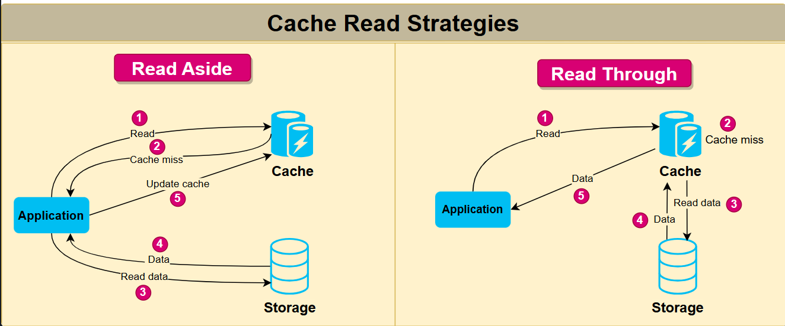

# Cache Read Strategies

## 🔍 Definition
> Cache read strategies define how applications interact with cache and underlying data stores when retrieving data, determining how cache misses are handled and where the responsibility for data fetching lies.

## 🧠 Key Ideas
- Determines who's responsible for retrieving data from the underlying store when cache misses occur
- Impacts application complexity, performance, and resilience
- Influences how cache consistency is maintained with the source of truth
- Different strategies have varying levels of fault tolerance and application complexity

## 📊 Real-world Use Case
Netflix uses read-through caching with EVCache for user recommendations, while many web applications use read-aside caching for user session data. Database systems like Redis and Memcached are commonly used in read-aside patterns, while CDNs often implement read-through strategies for content delivery.

## 📈 Diagram

### Read-Through Cache
Read-Through caching is a strategy where the cache sits between the application and the data store. When the application requests data:
1. The application first requests data from the cache
2. If the data is in the cache (cache hit), it's returned directly to the application
3. If the data is not in the cache (cache miss):
   - The cache itself (not the application) is responsible for fetching the data from the underlying data store
   - The cache then stores the fetched data and returns it to the application

This strategy abstracts away cache management from the application code. The application only needs to communicate with the cache, not with both the cache and data store. This is particularly useful in distributed systems where consistent caching logic is needed across multiple application instances.

#### ✅ Pros:
- Simplifies application code as cache manages data retrieval logic
- Centralizes caching logic in the cache component
- Maintains better consistency between cache and data store
- Application doesn't need to know about cache implementation details

#### ❌ Cons:
- Initial request for data is slower due to cache population overhead
- Can introduce an additional point of failure
- Less control over the caching logic from the application
- Cache component becomes more complex

### Read-Aside Cache (Cache-Aside/Lazy-Loading)
Read-Aside caching (also known as Cache-Aside or Lazy-Loading) is a strategy where the application manages the interaction with both the cache and the data store. When the application requests data:
1. The application first checks the cache for the requested data
2. If the data is in the cache (cache hit), it's returned to the application
3. If the data is not in the cache (cache miss):
   - The application directly fetches the data from the underlying data store
   - The application then updates the cache with this data for future requests
   - The application returns the data to the requester

This approach gives the application full control over its caching logic, allowing for customized caching strategies. It's the most commonly used caching pattern and allows applications to function even if the cache service experiences downtime.

#### ✅ Pros:
- Application maintains control over the caching process
- More resilient to cache failures (application can fallback to data store)
- Only caches data that is actually requested by the application
- Can implement custom logic for cache population

#### ❌ Cons:
- Adds complexity to application code which must handle cache misses
- Potential for inconsistency if multiple instances update the cache
- More network trips when cache miss occurs (client to cache, client to DB, client updating cache)
- Requires cache management logic in every application that uses the data

## 💬 Interview Context
- Common follow-up question to caching discussions in system design interviews
- Often asked to compare different cache strategies and explain which to use in specific scenarios
- May be asked to diagram how these strategies would work in a distributed system
- Expected to discuss how to handle cache consistency and the "thundering herd" problem
- Understanding of these strategies demonstrates knowledge of practical distributed system implementation

## 🔁 Revisit Frequency
[ ] Once a week  
[x] Once a month  
[ ] Before interviews

---
