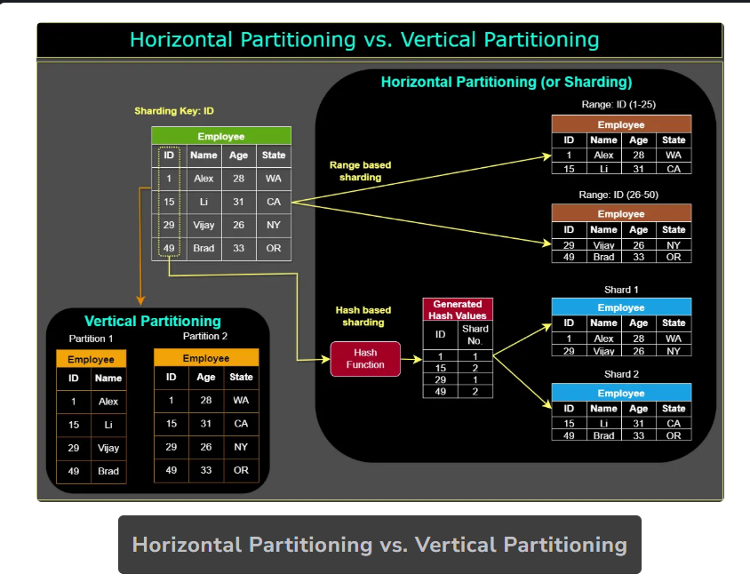

# Partitioning Methods

Designing an effective partitioning scheme requires careful consideration of application requirements and data characteristics. Here are three popular partitioning methods used in large-scale applications:

## Horizontal Partitioning (Sharding)

Horizontal partitioning divides a database table into multiple partitions or shards, each containing a subset of **rows**. Each shard typically resides on a different database server to enable parallel processing and faster query execution.

**Example:** A social media platform might partition its user table based on geographic location:
- Shard 1: Users in the United States
- Shard 2: Users in Europe
- Shard 3: Users in Asia

**Challenge:** If the partitioning value isn't chosen carefully, this can lead to unbalanced servers. For instance, partitioning by geographic location assumes an even distribution of users across regions, which may not be the case due to population density differences.

## Vertical Partitioning

Vertical partitioning splits a database table into multiple partitions, each containing a subset of **columns**. This optimizes performance by reducing the amount of data scanned, especially when certain columns are accessed more frequently than others.

**Example:** An e-commerce website might partition its customer table by data type:
- Partition 1: Personal information (name, address)
- Partition 2: Order history and payment information

## Hybrid Partitioning

Hybrid partitioning combines both horizontal and vertical techniques to distribute data across multiple shards. This approach optimizes performance by distributing data evenly while minimizing the amount of data that needs to be scanned.

**Example:** A large e-commerce platform might:
1. Horizontally partition customer data by geographic location
2. Then vertically partition each shard based on data type
3. Store each resulting partition on different database servers

