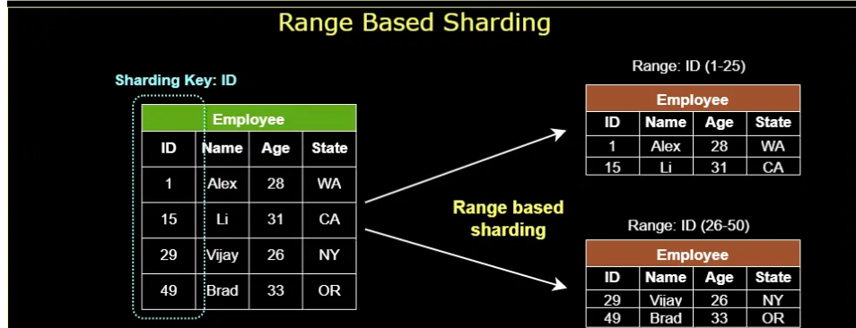
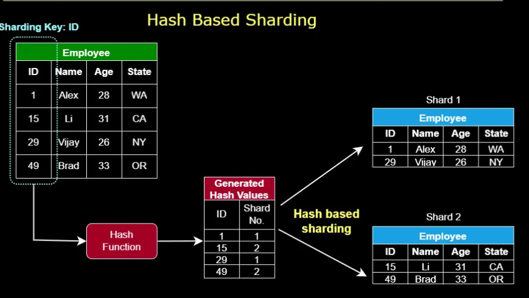
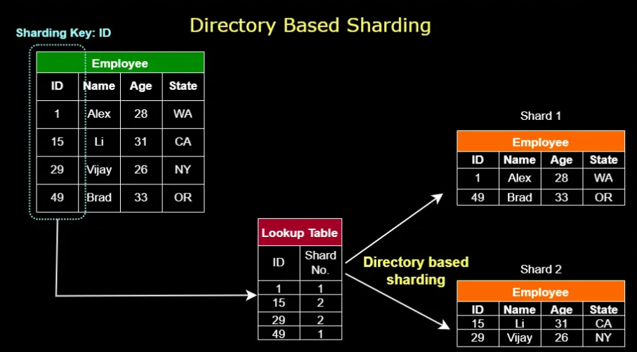
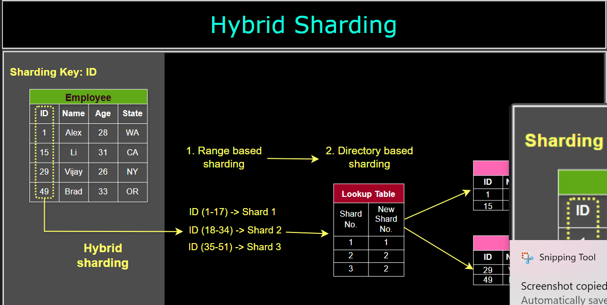

# Data Sharding Techniques

Data sharding is a horizontal partitioning technique that distributes large datasets across multiple storage resources (shards). This approach improves performance, scalability, and resource utilization by dividing data into smaller, more manageable pieces.

## 1. Range-based Sharding

Range-based sharding divides data based on specific ranges of a partitioning key value.

**Example:** An e-commerce platform might shard order data by date ranges (monthly/yearly). Queries for specific date ranges only access relevant shards, improving performance.

## 2. Hash-based Sharding

Hash-based sharding applies a consistent hash function to the partitioning key to determine the destination shard. This method ensures even data distribution, especially for keys with many distinct values.

**Example:** A social media platform may shard user data based on a hash of user IDs, ensuring balanced data distribution across storage resources.

## 3. Directory-based Sharding

Directory-based sharding uses a lookup table to map data entries to specific shards. This provides flexibility to add, remove, or reorganize shards without rehashing the entire dataset.

**Example:** An online gaming platform maintains a directory mapping player usernames to specific shards. The system consults this directory before retrieving player data.

## 4. Geographical Sharding

Geographical sharding partitions data based on geographic locations, reducing latency by storing data closer to users.

**Example:** A global streaming service stores user data in shards based on country location, with shards physically located in data centers within or near those countries.

## 5. Dynamic Sharding

Dynamic sharding adaptively adjusts the number of shards based on data size and access patterns, optimizing resource utilization by creating, merging, or splitting shards as needed.

**Example:** An IoT platform automatically adjusts shards based on the volume and frequency of incoming sensor data from devices.

## 6. Hybrid Sharding

Hybrid sharding combines multiple sharding strategies to optimize performance, tailoring solutions by leveraging the strengths of different techniques.

**Example:** Cloud service providers often employ hybrid approaches, combining geographical sharding with directory or hash-based methods to deliver consistent, high-speed services globally.

