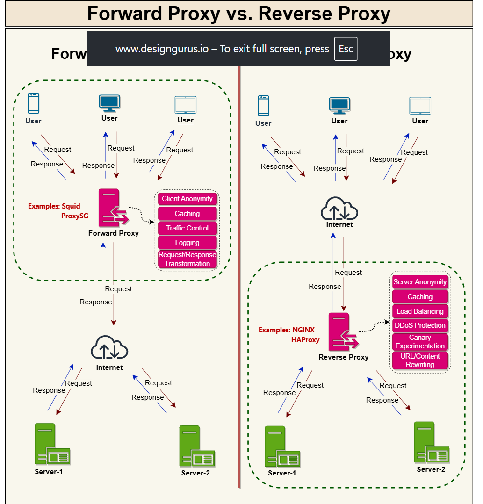

# What Is A Proxy Server?

A proxy server acts as an intermediary between clients and servers, handling requests and responses on behalf of either side. Proxies provide various benefits including enhanced security, improved performance, and traffic management.

## Types of Proxy Servers

### Forward Proxy

A forward proxy (commonly just called a "proxy server" or "proxy") sits in front of client machines and acts as an intermediary between these clients and the internet.

**Key characteristics:**
- Sits between client machines and the internet
- Receives requests from clients and forwards them to destination servers
- Returns responses from servers back to clients
- **Hides the identity of the client** from destination servers

**Common uses:**
- Caching data to improve performance
- Filtering requests (content filtering)
- Logging client requests
- Transforming requests (adding/removing headers, encryption/decryption, compression)
- Bypassing geographic restrictions
- Providing anonymity for clients

Forward proxies can also optimize traffic through techniques like **collapsed forwarding**, where multiple identical requests are combined into a single request to reduce redundant data fetching.

### Reverse Proxy

A reverse proxy sits in front of web servers and acts as an intermediary between these servers and clients on the internet.

**Key characteristics:**
- Sits between the internet and web servers
- Receives requests from clients and forwards them to appropriate backend servers
- Returns responses from backend servers back to clients
- **Hides the identity of the server** from clients

**Common uses:**
- Load balancing across multiple backend servers
- Caching static content
- SSL termination
- Compression
- Security (protecting backend servers from direct exposure)
- Centralized authentication

## Forward Proxy vs. Reverse Proxy

The fundamental difference lies in whose identity they protect:

- **Forward Proxy**: Protects client identity
- **Reverse Proxy**: Protects server identity

## Summary

A proxy is a piece of software or hardware that sits between clients and servers to facilitate and manage traffic. When you want to protect clients on your internal network, place them behind a forward proxy. When you want to protect your servers, place them behind a reverse proxy.

Proxies are essential components in modern system design, offering security, performance optimization, and better traffic management capabilities.

