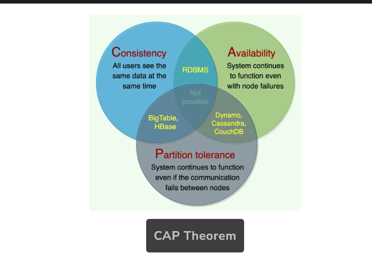

# Introduction to CAP Theorem

## Core Concept

The CAP theorem (also known as Brewer's theorem) is a fundamental principle in distributed systems that states **it is impossible for a distributed system to simultaneously provide all three guarantees**:

- **Consistency (C)**: All nodes see the same data at the same time
- **Availability (A)**: Every request receives a response, without guarantee that it contains the most recent version
- **Partition Tolerance (P)**: The system continues to operate despite network partitions

In other words: **In case of a network partition, you must choose between consistency and availability**.

## Key Properties Explained

### Consistency (C)
- **Definition**: All nodes see the same data at the same time
- **Technical meaning**: Every read receives the most recent successful write
- **Example**: When you update your profile picture, all users immediately see the new picture
- **Note**: This is different from ACID consistency in databases, which refers to transaction validity

### Availability (A)
- **Definition**: Every non-failing node returns a response for all read and write requests
- **Technical meaning**: The system remains operational and responsive at all times
- **Example**: A social media platform that keeps working even when some servers are down
- **Trade-off**: May return stale data during network partitions if prioritized over consistency

### Partition Tolerance (P)
- **Definition**: The system continues to operate despite network failures
- **Technical meaning**: System continues functioning when messages between nodes are delayed or lost
- **Reality**: In distributed systems, network partitions are unavoidable
- **Implication**: P is essentially required, so the real choice is between C and A

## CAP Theorem Combinations

### CA Systems (Consistency + Availability, No Partition Tolerance)
- **Example**: Traditional single-node relational databases
- **Limitation**: Not truly distributed; fails completely during network partitions
- **Use case**: Systems where network partitions are extremely rare or impossible

### CP Systems (Consistency + Partition Tolerance, Limited Availability)
- **Examples**: HBase, MongoDB (with strong consistency settings), ZooKeeper
- **Behavior**: During partition, affected nodes become unavailable rather than return stale data
- **Use case**: Banking systems, payment processing, inventory systems where data accuracy is critical

### AP Systems (Availability + Partition Tolerance, Eventual Consistency)
- **Examples**: Cassandra, Amazon DynamoDB, CouchDB
- **Behavior**: System remains available during partitions but may return stale data
- **Use case**: Social media, content delivery, systems where temporary inconsistency is acceptable

## CAP Theorem Visualization

## Practical Implications

### Making the Right Choice
- **Business needs**: Financial systems typically prioritize consistency (CP)
- **User experience**: Social media platforms often prioritize availability (AP)
- **Modern approach**: Many systems implement different consistency models for different operations

### Beyond CAP
- **PACELC theorem**: Extends CAP by addressing system behavior when no partition exists
  - **P**: If there is a partition, choose between A and C
  - **E**: Else (no partition), choose between L (latency) and C (consistency)

### Consistency Models
- **Strong Consistency**: All nodes see the same data at the same time
- **Eventual Consistency**: All nodes will eventually converge to the same data
- **Causal Consistency**: Operations that are causally related appear in the same order
- **Read-your-writes Consistency**: A user always sees their own updates

## Real-world Examples

### Banking Applications
- **Priority**: Consistency over availability
- **Behavior**: May become temporarily unavailable rather than risk incorrect balance display
- **Model**: CP system with strong consistency guarantees

### Social Media Platforms
- **Priority**: Availability over strict consistency
- **Behavior**: Feed might show slightly stale data during network issues
- **Model**: AP system with eventual consistency

### E-commerce Systems
- **Mixed approach**: CP for inventory and payments, AP for product recommendations
- **Behavior**: Order processing might be unavailable during partitions, but browsing still works

## System Design Considerations

- **Partition handling strategies**: Read-only mode, limited functionality, leader election
- **Consistency tuning**: Configurable consistency levels (e.g., quorum-based reads/writes)
- **Conflict resolution**: Vector clocks, last-write-wins, custom merge functions
- **Monitoring**: Detecting and measuring inconsistency windows
- **Testing**: Chaos engineering to simulate network partitions

## Interview Tips

- **Know the limitations**: Understand when CAP theorem applies and when it doesn't
- **Real examples**: Be prepared to classify real-world systems as CP or AP
- **Trade-offs**: Be ready to justify consistency vs. availability choices for different scenarios
- **Beyond CAP**: Demonstrate knowledge of consistency models and PACELC
