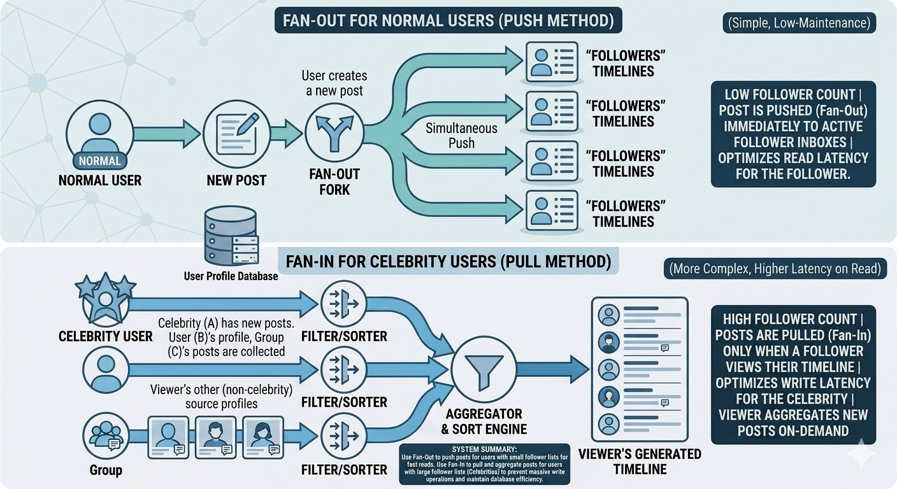

# Designing online social networking service like Twitter

## Table of Contents
<div style="font-size: 20px; line-height: 1.8em;">

1. 📌 [Problem Statement](#-problem-statement)
2. 📋 [Requirements and Goals of the System](#-requirements-and-goals-of-the-system)
3. 📊 [Capacity Estimation and Constraints](#-capacity-estimation-and-constraints)
4. 🧾[System APIs](#system-apis)
5. 🏗️ [High-Level Design](#-high-level-design)
6. 🗄️ [Database Schema](#database-schema)
7. 🪓 [Data Sharding](#data-sharding)
8. 🧊 [Cache](#cache)
9. 📺 [Timeline Generation](#timeline-generation)
10. 🗄️🔁 [Replication and Fault Tolerance](#-replication-and-fault-tolerance)
11. 🔀 [Load Balancing](#-load-balancing)
12. 👁️ [Monitoring](#monitoring)
13. 📋 [Extended Requirements](#-extended-requirements)
14. 💬 [Question & Answer Style](#qa)
15. 🎬 [Complete Interview Narrative](#complete-interview-narrative)

</div>

## 📌 Problem Statement

- users post short messages
- follow others
- read personalized feed
- interact with tweets
- system must scale and stay fast
## 📋 Requirements and Goals of the System
### Functional Requirement
- Post tweet
- Follow/unfollow
- Home timeline
- User timeline
- Like/reply/repost
- Delete tweet
### Non-Functional 
- High availability
- Scalability
- Low latency
- Durability
- Fault tolerance
- Eventual consistency
### 🗣️ What to say in interview

>I’m designing a Twitter-like system where users can publish short posts, follow others, and consume a personalized timeline. The core functional requirements are posting tweets, following users, and generating timelines. From a non-functional perspective, the main goals are high availability, scalability, low latency, and handling a read-heavy workload efficiently.

## 📊 Capacity Estimation and Constraints
 ### Assumptions:
- total user : 1 Billion
- DAU: 200 million user
- each user tweet 2 times per day
 ### write QPS:
#### 1. Tweets(write):
 - Total tweets /day: 200 M *2 = 400 Million tweets/day.
 - QPS for tweets: 400M / 86400 ≈ 4630 tweets /seconds

> if we use 100,000 second per day in above calculation we will get write QPS of 4000 tweets/second
### Read QPS:
#### TimeLine views(Read):
 - 200 M DAU
 - Each user checks timelines 5 time/day.
 - Total : 200M *  5 = 1B /day
 - QPS: 1 B/ 86400 = 11600 reads/second
> for rough interview math, if we use 100,000 second/day, read QPS will be 10,000 reads/sec.

### storage Estimation:
#### Assumptions:
- Average tweet size: 300 bytes (including metadata)
- DAU: 200 M
- each user tweets 2 times per day
- Daily tweets storage = 200 M *2* 300 bytes = 120,000,000,000 bytes = 120 GB/day
- Yearly storage = 120 GB * 365 = 43,800 GB ≈ 44 TB/year
- Total storage for 5 years = 44 TB * 5 = 220 TB
- Assume 3 replicas:
  - 1 year: 44 TB * 3 = 132 TB
  - 5 year: 132 TB * 5 = 660 TB
  - 10 year: 132 TB * 10 = 1.32 PB
### Bandwidth Estimation:
#### Assumptions:
- Each tweet is 300 bytes
- response size for timeline is 300 bytes (1 tweet) * 20 tweets = 6000 bytes
-  so timeline response is  the size of 20 tweets = 6000 bytes
- we have calculated write and read QPS:
- Write QPS: 4,000
- Read QPS: 10,000
- Average tweet size: 300 bytes
- so write bandwidth(Ingress)= 4,000 * 300 bytets(1 tweet) = 1200,000 bytes/second = 1.2 MB/s
- Read bandwidth(Egress) = 10,000 * 300 bytes * 20 = 60,000,000 bytes/second = 60 MB/s

**NOTE:**
- a timeline response typically contains multiple tweets (e.g., ~20), so its size is the combined size of those tweets, not just 300 bytes.
- In reality, response size is larger because it also includes user info, engagement counts, and media URLs, so 6 KB is actually a lower-bound estimate

### 🗣️ What to say in interview
> These numbers indicate a read-heavy system where timeline generation is the primary bottleneck, so we should optimize for low-latency reads using caching, precomputation, and efficient data distribution.
 
## 🧾System APIs
define APIs for:
- POST /tweets → create tweet
- GET /users/{id}/timeline/home → home feed
- GET /users/{id}/timeline/user → user tweets
- POST /users/{id}/follow/{targetId} → follow
- DELETE /users/{id}/follow/{targetId} → unfollow
- POST /tweets/{id}/like → favorite/like
- POST /tweets/{id}/retweet → retweet
- POST /tweets/{id}/reply → reply
- DELETE /tweets/{id} → delete tweet

**Notes**
- Use REST APIs
- Use cursor-based pagination for timelines
- Media uploaded separately
- Auth + rate limiting required
### 🗣️ What to say in interview
> After clarifying requirements, I’d define the main APIs. At minimum, the system needs APIs to post tweets, fetch the home timeline, fetch a user timeline, follow and unfollow users, and support engagements like like, reply, and retweet. Timeline APIs should support pagination using cursor-based paging


## 🏗️ High-Level Design
### 🗣️ 1. One-line start (say this)

At a high level, I’ll design a read-optimized system with separate services for:
- tweet creation
- timeline generation
- user relationships, backed by caching and distributed storage.

#### ⚙️ 2. Core Components
- Clients (Mobile/Web)
- Load Balancer
- API Gateway
- Tweet Service (write path)
- Timeline Service (read path)
- User/Follow Service (social graph)
- Cache (Redis)
- Databases
  - Tweets DB
  - User DB
  - Follow Graph DB
- Message Queue (e.g., Kafka)
- Media Storage + CDN (images/videos)
## ⬆️ Write Flow: (Tweet Creation)

> User → Load Balancer → API Gateway → Tweet Service → DB → Queue → Fan-out → Cache

 **Steps:**
- User posts tweet
- API  Gate validates request and forwards to Tweet Service 
- Tweet service stores in Tweets DB
- Event sent to Message Queue
- Fan-out service pushes tweet to followers’ timelines
- Timeline cache updated
 ## ⬇️ Read Flow: (Timeline Generation)

> User → LB → API Gateway → Timeline Service → Cache → DB (fallback)

**Steps:**
- User opens app
- Timeline Service checks cache (Redis)
  - If hit → return tweets
  - If miss → fetch from DB → update cache → return


🧠 Visual (mental model)

```
                            Client
                              ↓
                        Load Balancer
                              ↓
                        API Gateway
                              ↓
                      -----------------------------
                      |     Tweet Service         |
                      |     Timeline Service      |
                      |     User Service          |
                      ----------------------------                              ↓
                          Message Queue
                                  ↓
                          Cache (Redis)
                                  ↓
                          Databases + Media Storage
                                  ↓
                                 CDN

```
 ### 🗣️ What to say in interview
> At a high level, clients connect through a load balancer to an API layer. We have separate services for tweets, timelines, and user relationships. Tweets are stored in a distributed database and propagated via a message queue. Timeline reads are served primarily from cache for low latency, with database fallback. Media is stored in object storage and served via CDN. Since the system is read-heavy, caching and efficient timeline generation are key.


## Database Schema
 here are some simplified schemas for the main entities:

- **User**: user_id, username, profile info, created_at
- **Tweet**: tweet_id, user_id, text, created_at, reply_to, retweet_of
- **Follow**: follower_id, followee_id, created_at 
- **Like**: user_id, tweet_id, created_at
- **Timeline**: viewer_user_id, tweet_id, author_id, created_at 
- **Media**: media_id, tweet_id, media_url, media_type
 
### What to use
| Entity / Table                 | Storage Choice                 | Why                                                                                                 | Trade-off                                       |
| ------------------------------ | ------------------------------ | --------------------------------------------------------------------------------------------------- | ----------------------------------------------- |
| **User**                       | **SQL**                        | Structured data, unique constraints, profile/account updates, strong consistency                    | Harder to scale horizontally than NoSQL         |
| **Tweet**                      | **NoSQL**                      | Massive write volume, huge dataset, simple access by tweet id or author id, easy horizontal scaling | Weaker joins, usually eventual consistency      |
| **Follow**                     | **SQL early / NoSQL at scale** | Relationship data may need consistency, but becomes huge and high-traffic at scale                  | SQL is simpler early, NoSQL scales better later |
| **Like**                       | **SQL early / NoSQL at scale** | Many-to-many relationship; can start in SQL, but high write volume can push it to NoSQL later       | SQL gives integrity, NoSQL gives scale          |
| **Timeline**                   | **NoSQL**                      | Read-heavy, precomputed feed entries, large fan-out data, needs fast key-based access               | Data duplication, denormalization               |
| **Media metadata**             | **SQL or NoSQL**               | Small metadata record; either works depending on scale and query needs                              | SQL is cleaner, NoSQL scales more easily        |
| **Media files**                | **Object Storage**             | Large blobs should not live in DB; cheaper and scalable                                             | Need separate metadata management               |
| **Counters** (likes, retweets) | **Redis / Cache**              | Very frequent reads, low-latency access                                                             | May be temporarily stale                        |
| **Hot tweets / home timeline** | **Redis / Cache**              | Fast read path, reduces DB pressure                                                                 | Invalidation complexity                         |
**Note**: SQL early /NoSQL at scale means we can start with a relational database for simplicity and consistency, but as the system grows, we may need to migrate to a NoSQL solution for better scalability and performance.
### 🗣️ What to say in interview
> I wouldn’t rely on a single database for everything and would choose storage based on access patterns. For user profiles and some relationship data, I would use a relational database because it provides strong consistency, schema enforcement, and supports transactional updates. The trade-off is that SQL systems don’t scale as easily horizontally and are not ideal for very high write throughput.
>
>For tweets and timeline data, I would use a distributed NoSQL database because it handles large-scale reads and writes efficiently and scales horizontally across multiple nodes. The trade-off here is weaker consistency and limited support for joins, so we often need to denormalize data and handle complexity at the application level.
> 
>Media files like images and videos would be stored in object storage and served via CDN, since storing large blobs in databases is inefficient. Finally, I would add a caching layer like Redis to store hot timelines and frequently accessed tweets to reduce latency and database load.l, the choice of databases and schema design should align with the read/write patterns and scalability requirements of the system, ensuring that we can efficiently serve timelines while handling a high volume of tweets and user interactions.
 
## 🪓Data Sharding
### 🗣️ what to say in interview- Start (show thinking)

<!--  Fix this"
Data sharding strategy — your TOC lists it but the content was light.
You need to understand how to shard tweets (by tweet_id? user_id? time-based?) and the trade-offs of each
1. go to chatgpt and study Tweet Table Sharding Options 
2.add tweet sharding example
-->


>There are multiple ways to shard data in a Twitter-like system. The most important sharding decision is for the Tweet table, since it is large and heavily accessed. We can shard tweets by author ID, tweet ID, or time, and each option has trade-offs.

### 1. Tweet Table Sharding Options
blow are some common sharding strategies for Tweet table followed by an example of 
how to shard, but before that let's have some assumption for our example:
- Assumptions:
  - we have 4 shards:
    - Shard 0
    - Shard 1
    - Shard 2
    - Shard 3

  - And these tweets:
    - Tweet T1 by user U10
    - Tweet T2 by user U10
    - Tweet T3 by user U25
    - Tweet T4 by user U99
#### A. Shard by author_user_id

Store all tweets of a user together.

##### Example:

Rule: ``shard = user_id % 4``
- Tweet T1 by user U10 → Shard 2 (10 % 4 = 2) 
- Tweet T2 by user U10 → Shard 2 (10 % 4 = 2) 
- Tweet T3 by user U25 → Shard 1 (25 % 4 = 1) 
- Tweet T4 by user U99 → Shard 3 (99 % 4 = 3) 


- ✅ **Pros:**
  - efficient for user/profile timeline queries
  - good data locality
  - easy to fetch all tweets of one user
- ❌ **Cons:**
  - hot shard problem for celebrity users
  - uneven data distribution
#### B. Shard by tweet_id

Distribute tweets more evenly across shards.

##### Example:

Rule: ``shard = tweet_id % 4``
- Tweet T1 (id 100) → Shard 0 (100 % 4 = 0) 
- Tweet T2 (id 101) → Shard 1 (101 % 4 = 1)
- Tweet T3 (id 102) → Shard 2 (102 % 4 = 2)
- Tweet T4 (id 103) → Shard 3 (103 % 4 = 3)
  
**What this means**

Tweets are spread evenly, but tweets from the same user are no longer together.

- ✅ **Pros:**
  - balanced distribution
  - avoids hot users
- ❌ **Cons:**
- expensive reads for user timeline
- need scatter-gather across multiple shards
#### C. Shard by creation_time

Store tweets by time range.
 ##### Example:

- Assumptions: 
  - Rules:
    - ``shard = (creation_time / time_window) % 4``
    - Tweets created in the same time window go to the same shard.
      > - tweets from 10:00–10:59 → Shard 0
      > - tweets from 11:00–11:59 → Shard 1
      > - tweets from 12:00–12:59 → Shard 2
      > - tweets from 13:00–13:59 → Shard 3

    - so if we have tweets created at different times:
  
      > - Tweet T1 at 10:15 → Shard 0
      > - Tweet T2 at 10:45 → Shard 0
      > - Tweet T3 at 11:30 → Shard 1
      > - Tweet T4 at 12:05 → Shard 2
      > - Tweet T5 at 13:20 → Shard 3
      > - Tweet T6 at 10:50 → Shard 0
    
- ✅ **Pros:**
  - efficient for recent tweet queries
  - good for recency-based scans

- ❌ **Cons:**
  - write hotspot on newest shard
  - read hotspot on recent shard
  
#### D. Hybrid tweet_id + time

Use tweet IDs that embed timestamp.

##### Example:
- Rule: ``tweet_id = timestamp + random_suffix`` and ``shard = tweet_id % 4``   
- Example of tweet IDs:
  - Tweet T1 at 10:15 → tweet_id = 202410101015 + random → Shard 0
  - Tweet T2 at 10:45 → tweet_id = 202410101045 + random → Shard 1
  - Tweet T3 at 11:30 → tweet_id = 202410111130 + random → Shard 2
  - Tweet T4 at 12:05 → tweet_id = 202410121205 + random → Shard 3

- ✅ **Pros:**
  - better than pure time-based distribution
  - easier ordering by recency

- ❌ **Cons:**
  - still expensive for timeline queries
  - more complex ID generation
### 2. Final Choice for Tweet Table

I would shard the Tweet table by **author_user_id**.

- **Why**:

  - Twitter is read-heavy.
  - fetching tweets by author is common
  - timeline generation and profile reads benefit from locality
- **Trade-off**
  - hot users can overload a shard
- **Mitigation**
  - Redis cache
  - read replicas
  - async fan-out
  - heavy-user special handling if needed
### 3. Final System-Wide Sharding Strategy
   - Users → user_id
   - Tweets → author_user_id
   - Followers → followee_id
   - Following → follower_id
   - Timeline → viewer_user_id
   - Likes → tweet_id
### 4. Why this works

we shard each dataset based on its access pattern. This reduces cross-shard queries and makes the most common read paths faster.

### 5. Final trade-off logic
| Option           | Main problem        |
| ---------------- | ------------------- |
| `author_user_id` | hot users           |
| `tweet_id`       | expensive reads     |
| `time`           | write/read hotspots |


Since Twitter is read-heavy, expensive reads are worse than hot users. So I choose author_user_id and mitigate hot shards with caching and replication.

#### 🗣️ What to say in interview

>For the Tweet table, there are several sharding options such as author-based, tweetID-based, and time-based sharding. Sharding by author ID gives better locality for profile and timeline-related reads but can create hot shards for celebrity users. TweetID-based sharding distributes data more evenly, but it makes reads more expensive because tweets of one author are spread across many shards. Time-based sharding helps with recent data access but creates hotspots on the newest shard. Since Twitter is a read-heavy system, I would shard tweets by author_user_id and handle hot users with cache, replicas, and async fan-out. Then for the rest of the system, I would shard each dataset based on access pattern, such as timelines by viewer ID and follow relationships by follower or followee ID.


## 🧊Cache
**What caching means here**

Caching means we store frequently needed data in fast memory like Redis, so we do not have to go back to the database every time.

**_Simple idea_**: Cache = _saved answer to a common question_

### Why we need caching

Twitter is a read-heavy system. That means:
- many users open the app
- many users refresh timeline
- same tweets are read again and again
- popular users and popular tweets create heavy load
- So caching helps us:
  - reduce latency
  - reduce DB load
  - serve hot data faster
  - handle spikes better
### What to cache
#### 1. Home Timeline Cache
   - **What question does it answer?** ``What should this user see on their home page?``
   - **What do we store?** A precomputed list of tweet IDs for a specific user’s feed._Example: ```home_timeline:123 -> [t101, t102, t103, t104]```_
   - **Why is it useful?** Because generating a home feed every time is expensive:
     - find who user follows
     - get tweets from them
     - rank/sort
     - return top tweets
     
     Instead, we save the result.

#### 2. User Timeline Cache
   - **What question does it answer?**```What tweets has this user posted?```
   - **What do we store?** Recent tweet IDs for a specific author._Example:_ ```user_timeline:456 -> [t201, t202, t203]```
   - **Why is it useful?** This helps when someone opens a user’s profile page.

#### 3. Tweet Object Cache
- **What question does it answer?**```What is the content of tweet 789?```
- **What do we store?** The actual tweet data. _Example:_ tweet:789 -> {text: "hello world",author_id: 456,created_at: ...}
- **Why is it useful?** Because the same tweet can appear:
  - in many users’ home timelines
  - on the author’s profile
  - in replies or retweets

So instead of reading that tweet from DB many times, we keep it in cache.

#### 4. User Profile Cache
   - **What question does it answer?**```Who is this user?```
   - **What do we store?** User profile info. _Example:_ ```user:456 -> {name: "Shaho", username: "shaho_dev"}```
#### 5. Counter Cache
   - **What question does it answer?** How many likes / retweets / replies does this tweet have?
   - **What do we store?** Counters like. _Example:_```like_count:789 -> 120 retweet_count:789 -> 30 reply_count:789 -> 8``` 
   - **Why is it useful?** Counts are shown very often, and recalculating them from DB every time is expensive.

#### 6. Social Graph Cache
   - **What question does it answer?**  ```Who follows this user? Who is this user following?```
   - **What do we store?** Frequently accessed follower/following lists or counts. Example: ```followers_count:456 -> 1000000 following_count:456 -> 800```
### Read Path with cache

When user opens app:

```User -> Load Balancer -> API Gateway -> Timeline Service -> Cache -> DB fallback```
**Flow**
- User requests home timeline
- Timeline service checks cache first
- If found, return immediately
- If not found, read from DB / timeline store
- Put result in cache
- Return to user

This is usually called **_cache-aside_**.
### Write Path and cache

When something changes, cache may need update.

Examples:

- user posts a new tweet
- user likes a tweet
- user follows/unfollows someone
- tweet is deleted

Then we either:
- invalidate cache and rebuild later
- or update cache asynchronously
### ♟️Cache strategies
#### 1. Cache-aside

Most common.

**How it works**
- read cache first
- if miss, read DB
- save in cache
- return response

**Good for**
- tweet object
- user profile
- user timeline
#### 2. Invalidate on write

When data changes, delete affected cache entry.

Example:
- new tweet posted
- delete home_timeline:user_id

Next read rebuilds it.

#### 3. Async refresh / async update

Instead of updating cache immediately in request path, use queue/workers.

Example:
- new tweet arrives
- background workers update followers’ home timeline caches

This is useful for feed systems.

**for twitter we can use different strategies for different cache types**
- home timeline → async refresh (because it’s expensive to update immediately)
- user timeline → invalidate (because it’s only affected by that user’s tweets)
- tweet object → cache-aside (because it’s read often but changes rarely)
- counters → async update (because they change frequently but we can tolerate some staleness)
- social graph → cache-aside or invalidate (depends on how often follows/unfollows happen and how critical it is to have up-to-date data)
- user profile → cache-aside (because it changes infrequently but is read often)
### 🗣️ What to say in interview 
>Caching improves latency and reduces database load, but introduces challenges like stale data and invalidation complexity. For strategy, I would primarily use cache-aside for reads and invalidate or asynchronously refresh cache on writes. Each strategy has trade-offs—for example, cache-aside is simple but can have cache misses, while write-through ensures consistency but increases write latency.
### 🧹 Cache Eviction & Invalidation
**💡 Why this matters**:  Cache is not the source of truth → DB is.

So we must handle:
- when to remove/update cache
- how long data stays in cache

#### 🗑️ Cache Eviction (when cache is full)

Eviction decides what to remove when memory is limited.

Common strategies (Redis)
- LRU (Least Recently Used) ✅ (most common)
  - remove least accessed items
  - good for Twitter (hot data stays)
- LFU (Least Frequently Used)
  - remove least used items over time
  - TTL-based eviction
  - auto-remove after time expires
- ⏱️ TTL (Time To Live)
  - Each cache entry can expire after some time.
  - Example TTL choices:
  - | Cache Type    | TTL                     |
    | ------------- | ----------------------- |
    | Home timeline | short (seconds/minutes) |
    | Tweet object  | longer (minutes/hours)  |
    | User profile  | longer (hours)          |
    | Counters      | short (seconds)         |

- 👉 Why:
- timelines change frequently → short TTL
- tweet data rarely changes → longer TTL

#### 🔄 Cache Invalidation (VERY important)

we have 3 strategies for cache invalidation:

| Your term                        | Correct category              | Meaning                                    |
| -------------------------------- | ----------------------------- | ------------------------------------------ |
| **Invalidate on write**          | ✅ **Aggressive invalidation** | delete cache immediately when data changes |
| **Cache-aside**                  | ✅ **Lazy rebuild**            | delete → rebuild on next read              |
| **Async refresh / Async update** | ✅ **Async update**            | update cache later via background workers  |

Invalidate cache when data changes.

- 🧨 **Case 1: New Tweet**
  - User posts a tweet:
    - **Home timeline cache**
      - invalidate OR async update (fan-out)
    - **User timeline cache**
      - update or invalidate
- 🧨 **Case 2: Tweet Deleted**(👉 Critical case)
   - When a tweet is deleted:
     - remove from:
       - tweet:{tweet_id} cache
       - all home timelines containing it
       - all user timelines
       -  **How to handle home timeline and user timeline?**
           - Option 1 (simple):
             - invalidate affected caches
             - rebuild on next read
           - Option 2 (better):
             - mark tweet as deleted (soft delete)
             - filter it at read time
             - clean up async

- 🧨 **Case 3: Like / Counter Change**
  - update counter cache asynchronously
  - allow slight staleness

- 🧨 Case 4: Follow / Unfollow
  - invalidate home timeline
  -  rebuild feed

Below table summarize all above cases:

| Case                      | Cache Type         | Strategy                                   | Why                                             |
| ------------------------- | ------------------ | ------------------------------------------ | ----------------------------------------------- |
| **New Tweet**             | Home timeline      | **Async update**                           | Fan-out is expensive → do in background         |
|                           | User timeline      | **Aggressive invalidation / Async update** | Small scope → easy to update or invalidate      |
| **Tweet Deleted**         | Tweet object       | **Aggressive invalidation**                | Must remove immediately                         |
|                           | Timeline caches    | **Async update + Lazy rebuild**            | Too expensive to clean everywhere synchronously |
| **Like / Counter Change** | Counters           | **Async update**                           | High frequency, tolerate slight staleness       |
| **Follow / Unfollow**     | Home timeline      | **Aggressive invalidation**                | Feed becomes incorrect                          |
|                           | Timeline rebuild   | **Lazy rebuild (cache-aside)**             | Recompute on next read                          |
| **Tweet Object Update**   | `tweet:{tweet_id}` | **Lazy rebuild (cache-aside)**             | Rare updates, rebuild on demand                 |
| **User Profile Update**   | `user:{user_id}`   | **Lazy rebuild (cache-aside)**             | Low write frequency, high read                  |

#### Trade-offs cache invalidation strategies
| Strategy                         | What it means                                                   | Why use it                                                           | Pros                                                                     | Cons                                                                                                   | Best fit in Twitter                                    |
| -------------------------------- | --------------------------------------------------------------- | -------------------------------------------------------------------- | ------------------------------------------------------------------------ | ------------------------------------------------------------------------------------------------------ | ------------------------------------------------------ |
| **Aggressive invalidation**      | Delete cache immediately when underlying data changes           | Use when stale data would make the result obviously wrong            | simple logic, improves correctness, avoids long stale cache              | causes cache miss on next read, more DB/load on rebuild, can create latency spikes                     | follow/unfollow, tweet delete, structural feed changes |
| **Lazy rebuild (cache-aside)**   | On read: check cache, if miss then read DB and repopulate cache | Use when data is read often but updated rarely                       | simple, memory efficient, only caches what is actually needed            | first read after invalidation is slow, temporary stale data possible, thundering herd risk on hot keys | tweet object, user profile, some user timeline reads   |
| **Async update / async refresh** | Update cache later through background workers or queue          | Use when synchronous cache updates are too expensive in request path | keeps writes fast, good for heavy fan-out, smooths spikes, scales better | more complex, eventual consistency, background lag can cause staleness                                 | home timeline, counters, fan-out timeline updates      |

**Why you use each one**

- **1. Aggressive invalidation**

  - **Why use it:** Because some changes make cached data clearly incorrect right away.
  - **Example:** user unfollows someone, tweet is deleted
  - If you do not invalidate, the user may still see wrong tweets.
  - **Interview line**
  > I use aggressive invalidation when correctness matters more than cache hit rate, such as follow/unfollow or tweet deletion.

- **2. Lazy rebuild / cache-aside**

  - **Why use it:** Because the data does not change often, and rebuilding only when needed is efficient.
  - **Example** tweet object, user profile
  - These are read a lot, but updated infrequently.
  - **Interview line**

> I use cache-aside for relatively stable data like tweet objects and user profiles, because it is simple and avoids unnecessary cache writes.

- **3. Async update**
  - **Why use it:** Because some cache updates are too expensive to do immediately.
  - **Example:** home timeline fan-out, counters like likes/retweets
  - Updating millions of timeline caches synchronously would be too slow.
  - I**nterview line**

> I use async updates for timelines and counters because they are high-volume and can tolerate slight staleness, while keeping the write path fast.

## 📜 TimeLine/Feed Generation
For Twitter, timeline generation is one of the hardest parts because:
- reads are very high
- users may follow many people
- some users have millions of followers
- feed must be fast

 
So the design usually revolves around two strategies:
### 1. Fan-out on Write

**💡 Idea**:   
>  When a user posts a tweet, we immediately push that tweet into the home timelines of their followers.

**Example**:  If user A has 1,000 followers:
- A posts a tweet
- system writes that tweet ID into 1,000 timeline entries

**Why use it**
- very fast reads
- timeline already precomputed

**❗Problem**
- expensive for high-follower users
- celebrity tweet → millions of writes
### 2. Fan-in on Read

**💡 Idea**
> Do NOT precompute timelines.

- When user opens app:
  - fetch tweets from followed users
  - merge + sort + rank
  - return top results

**Why use it**
- cheaper writes
- avoids massive fan-out

**❗ Problem**
- slower reads
- high latency
- expensive at scale (read-heavy system)
### 3. 🏆 Hybrid Approach (Real Twitter Design)

**💡 Key Idea**
- Use fan-out for normal users
- Use fan-in for celebrity users

#### How  do we decide who is celebrity?

#### 🔥 1. Threshold (VERY important)

👉 Define a threshold based on follower count:

Example:
- if followers < 10K–100K → fan-out
- if followers > 10K–100K+ → fan-in

⚠️ Exact number is not fixed → depends on system capacity

#### 🧠 2. How do we detect “hot users”?

We track:
- follower count
- write amplification (fan-out cost)
- system load metrics

**Example:**  ``if follower_count(user) > THRESHOLD → mark as CELEBRITY``
#### 🛠️ How hybrid works in practice
##### A. Tweet Write Path

When user posts tweet:
````plain
if normal user:
  fan-out to followers’ timelines
else (celebrity):
  DO NOT fan-out fully
  store tweet only in tweet store
````
##### B. Timeline Read Path

When user opens app:

- Load precomputed timeline (fan-out data)
- Check if user follows any celebrity users
- Fetch recent tweets of those celebrity users
- Merge results
- Apply ranking()
- rank + return


 **Example:** User U follows:

- 100 normal users
-  2 celebrities
- Timeline generation:
  - normal users → already in cache (fan-out)
  - celebrities → fetched at read time (fan-in)
- 👉 merge both → final feed
### ⚖️ Trade-off

  | Approach | Cost               |
  | -------- | ------------------ |
  | Fan-out  | expensive writes   |
  | Fan-in   | expensive reads    |
  | Hybrid   | more complex logic |
### 🗣️ What to say in interview

> I would use a hybrid approach where normal users use fan-out on write to keep reads fast, while celebrity users use fan-in on read to avoid excessive write amplification. I would define a threshold based on follower count or system load to classify users. During timeline reads, I would merge precomputed timeline data with dynamically fetched tweets from celebrity users.

### 🔝Timeline Ranking (Add to your cheat sheet)
**💡 Idea:** Instead of showing tweets purely by time, we rank them based on relevance to the user.

**🧠 How it works (high level)**

After collecting tweets: apply a ranking function (ML model or heuristic)

- Signals can include:
  - recency (newer tweets)
  - engagement (likes, retweets, replies)
  - relationship strength (close friends, frequent interactions)
  - user interests (topics, past behavior)
  ##### 🗣️ One-line interview answer (THIS is what you need)
>Instead of purely chronological order, I would apply a ranking layer on top of timeline generation using signals like recency, engagement, and user interaction history to prioritize more relevant tweets.
### Home timeline storage format
For home timeline generation, we often store:

```home_timeline:{user_id} -> [tweet_id1, tweet_id2, tweet_id3]```

**Important:**
- usually store tweet IDs, not full tweet objects
- then fetch tweet objects from tweet cache / DB

**Why?**
- smaller storage
- easier update
- tweet object reused in many feeds
---
##### Components involved
- Tweet Service → handles new tweets
- Follow Service → knows follower graph
- Message Queue → async processing
- Fan-out Workers → distribute tweets to timelines
- Timeline Service → serves feed reads
- Redis / Timeline Cache → stores hot home timelines
- Tweet Store → stores actual tweets

### 🗣️ What to say in interview
> Timeline generation is the process of building the home feed a user sees by collecting tweets from accounts they follow, 
> ordering them, and returning the top results. 
> For Twitter, I would use a hybrid design. For normal users,
> I would use fan-out on write, where new tweets are pushed into followers’ home timeline stores so reads stay fast.
> For celebrity users, I would avoid full fan-out and instead use fan-in on read, where their tweets are fetched dynamically when a follower opens the app.
> This gives us low-latency reads for most users while avoiding write explosions for hot accounts.
## 🗄️🔁🗄️Replication and Fault Tolerance

**Why do we need it?** In Twitter-like systems:
 - tweets are critical data
 - timelines are read very often
 - machines, disks, and network links can fail

So replication helps with:
- high availability
- fault tolerance
- better read scalability
### where Replication is needed

#### 1. Tweet Storage
Store tweets in multiple replicas.

Example:
- 1 primary
- 2 replicas

So when user posts a tweet:
- write goes to primary
- replicated to followers/secondary replicas
 
**Benefit**: if one node fails, another replica can take over
#### 2. User / Follow Data: 
Replicate user profiles and follow graph too.

**Because:**
- follow graph is required for timeline generation
- if unavailable, feed generation breaks
#### 3. Cache Layer
Redis can also be replicated.

For example:

- primary cache node
- replica cache node
- failover using Sentinel / cluster manager
#### 4. Message Queue
Kafka or queue layer should also be replicated.

**Because:**
- tweet fan-out events should not be lost
- queue failure should not drop timeline update jobs
### Fault tolerance design ideas
#### 1. No single point of failure
 Every critical component should have redundancy:
- multiple app servers
- multiple DB replicas
- replicated cache
- replicated queue
- multiple load balancers / AZ deployment
#### 2. Automatic failover
If primary DB node fails:
- promote replica
- reroute writes

If app server fails:
- LB stops sending traffic there
#### 3. Multi-AZ / Multi-region deployment

Deploy copies across:
- different availability zones
- possibly multiple regions

- **Why**: one datacenter failure should not bring system down
#### 4. Durable writes

For important data like tweets:
- write must be persisted before acknowledging success
- often use replication quorum / durable log
#### 5. Retry + idempotency
If service fails in middle:
 - retry safely
 - avoid duplicate tweet creation
### 🗣️ What to say in interview
> To make the system fault-tolerant, I would replicate all critical data such as tweets, user data, follow relationships, cache, and message queues. For storage, I would use primary-replica replication so that writes go to the primary and reads can be served from replicas. This improves both availability and read scalability. If a node fails, traffic can be redirected to a healthy replica through automatic failover. I would also deploy services across multiple availability zones so that failure of a single machine or datacenter does not take down the system. The trade-off is higher storage cost, replication lag, and additional operational complexity, but it is necessary for a large-scale Twitter-like system.
## 🔀Load Balancing
### Where Load Balancers are used
#### 1. Client → API Layer (most important)
   User → Load Balancer → API Gateway → Services
   Role
   distribute user requests across API servers
   handle spikes
   route traffic to healthy instances
#### 2. Service → Service (internal LB)

Example:

Timeline Service → multiple Tweet Service instances
Fan-out workers → multiple DB nodes
#### 3. DB / Cache Layer (indirect)
   route reads to replicas
   distribute load across shards
#### Strategies
   - Round Robin
   - Least Connections ✅(why? because some requests may be heavier than others, so this helps balance load better)
   - Weighted
   - Health-aware
#### Design
   - stateless services
   - multi-AZ / multi-region
#### Trade-off
   - ✅ scalability
   - ✅ availability
   - ❌ added complexity
### 🗣️ What to say in interview
>I would place a load balancer between clients and the API layer to distribute incoming traffic across multiple stateless servers. This ensures high availability and efficient resource usage. Internally, I would also use load balancing between services and for routing reads to database replicas. I would prefer a least-connections or health-aware strategy over simple round robin to better handle uneven load. The services should remain stateless so that requests can be routed to any instance without dependency on session state.
## 👁️Monitoring
### 🗣️ One-line

>Monitoring ensures we can detect issues, measure system health, and respond quickly to failures.

### What to monitor
#### 1. System Metrics
   CPU, memory, disk, network
#### 2. Application Metrics
   QPS (read/write)
   latency (P95 / P99)
   error rate
#### 3. Business Metrics
   tweets/sec
   timeline load success rate
   engagement (likes, retweets)
#### 4. Infrastructure Health
   DB replicas status
   cache hit/miss rate
   queue lag (very important for fan-out)
### Alerts
   - high latency
   - high error rate
   - queue backlog growing
   - cache miss spike
   - node failures
### Tools (optional to mention)
   - metrics: Prometheus / Datadog
   - logs: ELK stack
   - tracing: OpenTelemetry
 ### 🗣️ What to say in interview
>I would monitor system, application, and business metrics such as QPS, latency, error rates, cache hit rate, and queue lag.
> Alerts should be triggered for anomalies like high latency or failures so the system can respond quickly and maintain reliability.
## 📋 Extended Requirements
 
### 🔍 1. Searching for tweets
- Use search index (e.g., Elasticsearch) on tweet text + hashtags
- Support keyword, hashtag, and recent/top results
### 💬 2. Replying to a tweet
- Store reply_to_tweet_id in Tweet table
- Build thread trees using parent-child relationship
### 🔥 3. Trending topics
 - Track hashtags/keywords frequency over time window
- Use stream processing (Kafka + aggregator) + cache results
### 🏷️ 4. Tagging other users
- Parse @username → map to user_id
- Store mentions + optionally trigger notifications
### 🔔 5. Tweet Notifications
- Event-driven system (queue)
 - Trigger on:
   - new tweet
   - mention
   - like/reply
   - Deliver via push/email asynchronously
### 🤝 6. Who to follow (Suggestions)
**Use:**
- mutual followers
- common interests
- graph-based recommendations
- Precompute + cache suggestions
### 🧩 7. Moments
- Curated collection of tweets
- Stored as list of tweet_ids
- Managed manually or semi-automatically
### 🗣️ What to say in interview

For extended features, I would use a search index for tweet search, model replies using parent tweet relationships, compute trending topics using stream processing, handle mentions and notifications through event-driven systems, generate follow suggestions using graph-based recommendations, and store moments as curated collections of tweet IDs.

