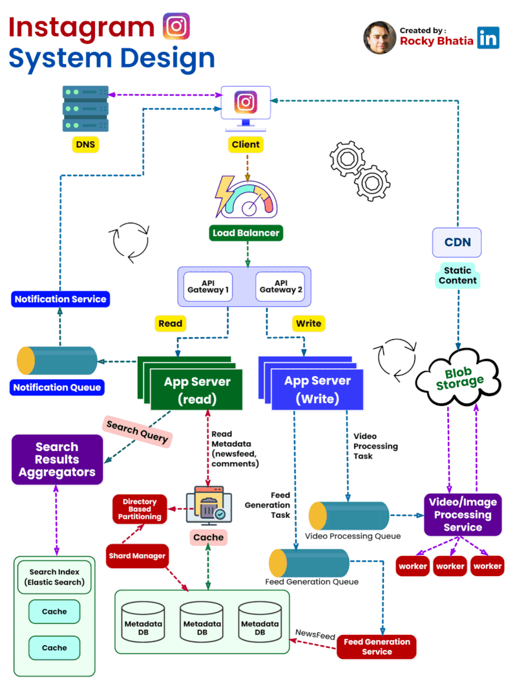
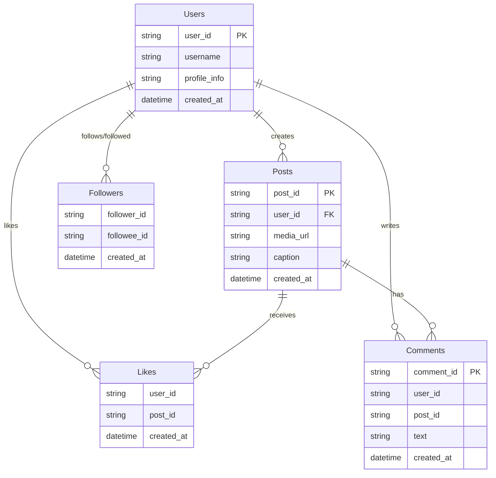

# Designing Instagram

## Table of Contents


4. [High Level System Design](#high-level-system-design)
5. [High Level System Design Story](#high-level-system-design-story)
6. 


<div style="font-size: 20px; line-height: 1.8em;">

1. 📌 [Problem Statement](#problem-statement)
2. 📋 [Requirements and Goals of the System](#requirements-and-goals-of-the-system)
3. 📊 [Capacity Estimation and Constraints](#capacity-estimation-and-constraints)
4. 🏗️ [High-Level Design](#high-level-design)
5. ⚙️ [Database Schema](#database-schema)
6. 📊 [Data Size Estimation](#data-size-estimation)
7. ⚙️[Component Design](#component-design)
8. ️🛡️[Reliability](#reliability)
9. 🧬[Redundancy](#redundancy)
10. 🪓[Data Sharding](#data-sharding)
11. 📰 [Instagram Feed Generation](#instagram-feed-generation)
12. 🧊🔀[Cache and Load Balancing](#cache-and-load-balancing)
13. 💬 [Question & Answer Style](#qa)
14. 🎬 [Complete Interview Narrative](#complete-interview-narrative)
</div>


---

## Problem Statement

Design a system like Instagram that allows users to share photos and videos, follow other users, and view a feed of content from the users they follow.

---

## Requirements and Goals of the System
### Functional Requirements
1. User should be able to upload/download/view photos.
2. User can perform search based on photo/video tags.
3. User can follow other users.
4. The system should generate and display a user's new feed Consisting of top photos from all the people the user follows.

### Non-Functional Requirements
1. The system should be highly available.
2. The acceptable latency for viewing a photo should be less than 200ms for News Feed generation.
3. Consistency can take a hit (in the interest of availability) if a user doesn’t see a photo for a while; it should be fine.
4. The system should be highly reliable; any uploaded photo or video should never be lost.
---
## 📊Capacity Estimation and Constraints

### 📈 Traffic Estimation
- Total users = 500M
- Daily active users (DAU) = 50M
- New photos uploaded per day = 20M
- Average photo size = 200 KB (Read-optimized compressed image)
- Read : Write ratio = 100 : 1
- Peak traffic factor = 3×

### 📈 Traffic Estimation
- **Average Write QPS:**

$$\text{QPS}_{\text{write}} \approx \frac{\text{Requests}_{\text{day}}}{86,400}$$
    so  

  $$20\text{ million} / 86,400\text{ seconds} \approx 200\text{ photos/s}$$
- **Peak Write QPS:**
  $$200 \times 3 = 600\text{ photos/s}$$
- **Average Read QPS:**
  $$200 \times 100 = 20,000\text{ read/s}$$
- **Peak Read QPS:**
  $$20,000 \times 3 = 60,000\text{ read/s}$$

### 📡Bandwidth Estimation
- **Inbound (write) bandwidth:**
 $$\text{B}_{\text{in}} = \text{QPS}_{\text{write}} \times \text{Photo Size}$$
so $$600 \text{ photos/s} \times 200 \text{ KB} = 120,000 \text{ KB/s} = 120 \text{ MB/s} = 960 \text{ Mb/s}$$
- **Outbound (read) bandwidth:**
$$\text{B}_{\text{out}} = \text{QPS}_{\text{read}} \times \text{Photo Size}$$
 so $$60,000 \text{ read/s} \times 200 \text{ KB} = 12,000 \text{ MB/s} = 12 \text{ GB/s} = 96 \text{ Gb/s}$$


### 💽Storage Estimation

$$ \text{Storage} = \text{Number of Photos} \times \text{Photo Size} \times \text{Overhead Factor} $$
so 
 $$ \text{Storage}_{\text{daily}} = 20\text{ million photos/day} \times 200 \text{ KB/photo} \times 2 \text{ (overhead)}  $$
so 
$$\text{Storage}_{\text{daily}} = 4,000 \text{ GB/day} = 4 \text{ TB/day}$$
$$ \text{Storage}_{\text{monthly}} = 4 \text{ TB/day} \times 30 \text{ days/month} = 120 \text{ TB/month} $$
$$\text{Storage}_{\text{yearly}} = 120 \text{ TB/month} \times 12 \text{ months/year} = 1.44 \text{ PB/year}$$

$$\text{Storage}_{\text{5 years}} = 14.4 \text{ PB over 5 years}$$


### Cache Impact

```
db_read_QPS = 60K * (1 - 20% hitRatio) = 48K QPS
cache_size = 48K QPS * 200 KB = 9600 MB/s = 9.6 GB/s
server_count = 60000 QPS / 2000 (capacity per server) = 60 servers for read
```

---
## High Level System Design


### 1. Entry Layer
**Path:** Client → DNS → Load Balancer → API Gateway

**Purpose:**
- Route requests
- Distribute traffic
- Authenticate / rate limit

---

### 2. Read / Write Separation

**App Server (Read):**
- Fetch feed
- Comments
- Profile
- Search queries

**App Server (Write):**
- Upload post
- Like / comment
- Follow
- Trigger async jobs

**Key Idea:** Read-heavy system → separate read and write services

---

### 3. Cache Layer
**Technology:** Redis / Memcached

**Stores hot data:**
- News feed
- Popular posts
- Comments
- Profiles

**Goal:**
- Reduce DB load
- Fast reads

---

### 4. Metadata Storage
**Technology:** Sharded Metadata DB

**Stores:**
- Users
- Posts
- Comments
- Likes
- Follows
- Media URLs

**Scaling Method:** Horizontal sharding

---

### 5. Media Storage
**Technology:** Blob Storage

**Stores:**
- Images
- Videos
- Thumbnails

---

### 6. CDN
**Technology:** Content Delivery Network

**Purpose:**
- Serve images/videos globally
- Reduce backend traffic
- Low latency

**Flow:** Client → CDN → Blob Storage

---

### 7. Feed Generation System
**Components:** Feed Generation Queue + Feed Generation Service

**Purpose:**
- Build user news feed
- Async processing

**Triggered when:**
- User creates post

---

### 8. Media Processing
**Technology:** Video/Image Processing Service

**Workers perform:**
- Resize image
- Generate thumbnails
- Video transcoding

**Execution:** Async via queue

---

### 9. Notification System
**Components:** Notification Queue → Notification Service

**Handles:**
- Like notifications
- Comment notifications
- Follow notifications


### 10. Search System
**Components:** Search Index (ElasticSearch) + Search Aggregator

**Handles:**
- User search
- Hashtag search
- Content search

---

---

## High Level System Design Story

### 1. Entry Flow

**Users interact with Instagram through mobile or web clients. Requests first go through DNS and a load balancer, which distributes traffic across backend services. Then an API gateway routes requests to the appropriate application services.**

### 2. Two Core Flows

   - **Write Flow (Posting):**

**When a user uploads a photo, the request goes to the write service. The system stores the media file in blob storage and stores metadata like captions, user ID, and timestamps in a metadata database.**

**After the post is created, the system sends events to background queues. These queues trigger feed generation, media processing like resizing images, and notification services.**

- **Read Flow (Viewing Feed):**

**When users open the app, they request their home feed through the read service. Since Instagram is extremely read-heavy, we place a cache in front of the metadata database to serve popular or recently accessed data quickly.**

**Actual images and videos are delivered through a CDN backed by blob storage so the application servers are not responsible for serving large media files.**

---


## Database Schema

### 1. Entity Relationship Diagram



### 2. Core Tables Description

**Users Table**
- Stores user profile information, authentication details, and metadata

**Posts Table**
- Stores post metadata including user ID, media URL, caption, and timestamp

**Followers Table**
- Maintains the social graph relationships between users

**Likes Table**
- Records user interactions (likes) on posts

**Comments Table**
- Stores comments associated with posts

**Feed Table (Important)**
- Pre-computed user feeds for fast retrieval
- Columns: `user_id` (PK), `post_id`, `created_at` (or `rank_score`)
- Indexed by user_id for efficient fan-out reads
- Used when implementing push-based feed generation

### 3. Database Technology Selection

#### Relational Database (SQL)

**Use For:**
- Users and authentication
- Posts metadata
- Followers (social graph)
- Comments
- Likes

**Technology:** MySQL or PostgreSQL

**Why SQL?**
- Relationships and joins support complex queries
- ACID compliance ensures data consistency for critical writes
- Structured schema provides strong validation

**🔥 One-line interview answer:** :"I use SQL for core metadata because relationships and consistency matter."

---

#### NoSQL / Key-Value Store

**Use For:**
- Feed timeline (user's home feed)
- Hot/cached data

**Technology:** Cassandra or DynamoDB

**Why NoSQL?**
- Extremely high read/write throughput
- Simple access pattern: `get_feed(user_id)`
- Horizontal scaling across multiple nodes
- Optimized for time-series data

**Interview Answer:** "Feed is a high-throughput access pattern, so I use NoSQL for fast reads and writes at scale."

---

#### Blob Storage

**Use For:**
- Images
- Videos
- Thumbnails

**Technology:** Amazon S3 or equivalent object storage

**Why Blob Storage?**
- Designed specifically for large unstructured data
- Cost-effective for media storage
- Scalable and durable

**🔥 One-line interview answer:** "Media is stored in blob storage, not in the database, and served via CDN."

---

#### Cache Layer

**Use For:**
- Hot feeds
- Popular post metadata
- User profiles

**Technology:** Redis or Memcached

---

#### Search Index

**Use For:**
- Username search
- Hashtag search
- Content discovery

**Technology:** Elasticsearch

---

### 4. Recommended Database Architecture Summary

| Component | Technology | Purpose |
|-----------|-----------|---------|
| Core Metadata | MySQL / PostgreSQL | Users, posts, followers, comments, likes |
| Feed Timeline | Cassandra / DynamoDB | High-throughput feed reads and writes |
| Media Files | S3 / Object Storage | Images, videos, thumbnails |
| Caching Layer | Redis / Memcached | Hot data and frequently accessed records |
| Search | Elasticsearch | Full-text search and content discovery |

**🔥 One-line interview answer:** 
"I would use a relational database like MySQL for core metadata such as users, posts, followers, comments, and likes. For the feed, which has very high read and write throughput, I would use a NoSQL or key-value store like Cassandra. Media files go to blob storage, and I use Redis for caching and Elasticsearch for search."
----

## Reliability

to ensure that the system is highly reliable and never loses data, we can implement the following strategies:


1. **Durable writes (never lose data)**

   - Store media in blob storage
   - Store metadata in DB
   - ✅ Acknowledge only after both succeed
2. **Async everything non-critical**

   - Feed fanout, notifications, media processing
   - Use durable queues
   - ✅ Retry on failure

3. **Safe retries (idempotency)**
   - Prevent duplicate posts / likes
   - Handle client + worker retries safely

4. **Reliable reads (fallbacks)**

   - Cache → DB fallback
   - If something fails → return stale/partial data
   - ✅ Never fail the whole request

5. **Failure handling + recovery**
   - Timeouts + retries
   - DB replication + failover
   - Monitoring + backups

**🔥 One-line interview answer:** 

"To ensure reliability, I would use durable storage for media and metadata, implement async processing with retries for non-critical tasks, design idempotent operations to handle retries safely, provide fallbacks for reads, and have robust failure handling 
and recovery mechanisms in place."

## Redundancy

to ensure high availability and prevent any single point of failure, we can implement redundancy at multiple layers of the system:

1. Replicate app servers

   - Run many stateless backend servers
   - Put them behind a load balancer
   - ✅ If one server dies, others continue serving traffic

2. Replicate across availability zones

   - Deploy services in multiple AZs / data centers
   - ✅ If one zone goes down, the app still works from other zones

3. Replicate databases:
   - Primary + replicas
   - Fail over to another replica if primary fails
   - ✅ Prevent DB from being a single point of failure

4. Replicate storage, cache, and queues
   - Media stored with multiple copies in durable blob storage
   - Cache cluster has multiple nodes
   - Queues/brokers are distributed
   - ✅ Failure of one node should not lose data or stop processing

5. Backups and disaster recovery
   - Replication helps with availability
   - Backups help with corruption, accidental delete, major outage
   - ✅ Survive bigger failures, not just machine crashes

**🔥 One-line interview answer:**

“To make Instagram redundant, I remove single points of failure by replicating every critical component across servers and zones, so if one machine or even one data center fails, the system continues running.”
\

## Data Sharding
To handle the massive scale of Instagram, we need to shard our databases to distribute data across multiple machines. Here’s how I would approach sharding:
Instagram Sharding — Final Cheat Sheet

**Core Rule: **Shard by access pattern (not one global key)

###  Data → Shard Key 
 - Users → user_id
 - Posts → owner_user_id (default)
 - Followers → followee_id
 - Following → follower_id
 -  Comments → post_id
 - Likes → post_id
 - Feed → viewer_user_id

####  Post Sharding Options:

- **owner_user_id:**
  -  ✅ simple, good for profile reads
  -  ❌ hot users, uneven load

- **photo_id:**
  - ✅ uniform distribution
  - ❌ harder user queries

👉 Answer: start with owner_user_id

####  Hot User Handling:
 - cache hot profiles/posts
 - add read replicas
 - async fan-out (queues)
 - hybrid feed (celebs = fan-out on read)
 - sub-partition large users (time/range split)
 - separate counters (likes/followers)

👉 **Must Mention:**
 - logical shards + shard map (no hardcoded % N)
 - distributed ID generation
 - avoid cross-shard joins → denormalize

**🔥 One-line interview answer:**
```
“I shard each dataset by its access pattern, and for hot users I offload load using cache, 
replicas, and async fan-out so no single shard becomes a bottleneck.”
```

## Instagram Feed Generation

### Why Feed Generation is Hard

The feed system faces unique challenges:

- **Read-heavy**: Billions of feed reads per day
- **Write-heavy**: Hundreds of millions of posts per day
- **Requirements**: Personalized results, low latency, near real-time delivery
- **Trade-offs**: Consistency vs. freshness vs. cost

**Story**: Feed is hard because we must deliver personalized results at massive scale with low latency while handling huge write bursts.

---

### Fan-out vs Fan-in Strategies

#### Fan-out on Write (Push Model)

**What**: On post creation → push post_id into all followers' timelines

**Pros:**
- Fast reads (precomputed feed)
- No joins at read time

**Cons:**
- Write amplification (1 post → millions of writes)
- Heavy load for celebrity users
- Slower writes

#### Fan-in on Read (Pull Model)

**What**: On feed request → fetch posts from all followed users

**Pros:**
- Simple writes (single insert)
- No write amplification

**Cons:**
- Slow reads (many queries/joins)
- Hard ranking across distributed data

#### Hybrid Approach (Instagram Strategy)

- **Fan-out on write** → normal users
- **Fan-in on read** → celebrities/high-fanout users

**Story**: "We push for small users and pull for large users to balance read latency and write explosion."

---

### Feed Generation Pipeline

#### Step 1: Post Creation

- User → Write Service
- **Store:**
  - Media → blob storage
  - Metadata → posts table
- **Publish event** (Kafka): `{ user_id, post_id, created_at }`

#### Step 2: Feed Generation Service

- Consume Kafka event
- Fetch followers (from sharded + cached graph)

#### Step 3: Feed Timeline Write (Fan-out)

- Insert into: `feed_timeline (user_id, post_id, created_at)`
- **Note**: Skip for celebrity users → handled via fan-in

#### Step 4: Caching & Ranking

- Cache top N posts (e.g., 100) in Redis
- **Precompute:**
  - Ranking score (ML)
  - Ordering
- **Key**: Avoid DB hits on every read

#### Step 5: Feed Read API

**Endpoint**: `GET /feed`

**Steps:**
1. Fetch post_ids from cache
2. Batch fetch post data from DB
3. Merge celebrity posts (fan-in)

---

### Key Design Decisions

| Decision | Rationale |
|----------|-----------|
| Use async pipeline (Kafka) | Decouple write from feed generation |
| Use denormalized feed table | Avoid joins |
| Use cache-first reads | Low latency |
| Use hybrid fan-out/fan-in | Scalability for all user types |

---

### Common Pitfalls (Interview Gold)

- **Pure fan-out** → Explodes for celebrities
- **Pure fan-in** → Slow reads
- **No caching** → DB bottleneck
- **Sync feed generation** → High latency

---

### One-Line Interview Summary

"I use a hybrid feed model—fan-out on write for normal users and fan-in on read for celebrities—combined with async pipelines and caching to deliver low-latency personalized feeds at scale."


## Cache and Load Balancing

These are not the core business logic, but they are critical because Instagram is read-heavy and must stay fast under huge traffic.

### 1. Load Balancing

Load balancers spread traffic across many servers so one server does not get overloaded.

In Instagram, load balancing is usually placed:

- Between clients and API servers
- Between services internally
- Across regions / zones
improves availability and failover
 #### Why it matters
- avoids single-server bottlenecks
- improves availability
- supports horizontal scaling
- enables failover if one instance dies

**🔥 One-line interview answer:**

“I put load balancers in front of stateless services so traffic is distributed evenly and the system can scale horizontally.”

### 2.Cache

Cache is used because feed reads, profile reads, post lookups, and counts happen way more often than writes.

Instead of hitting the database every time, Instagram stores hot data in Redis or Memcached.

### What we cache
 - home feed results
- post metadata
- user profile data
- follower/following counts
- popular comments / like counts
- ranked feed candidates
### Why it matters
- reduces DB load
- lowers latency
- handles traffic spikes
- helps hot users and viral posts
  
**🔥 One-line interview answer:**

“Since Instagram is heavily read-oriented, I place cache in front of databases to serve hot data quickly and reduce database pressure.”

### How they work together

Flow is usually:

```Client → Load Balancer → Read Service → Cache → DB (on cache miss)```

So:

load balancer decides which server handles the request
cache decides whether we can avoid going to the database

**🔥 One-line interview answer:**

“For Instagram, load balancing gives me scalability and availability, while caching gives me low latency and protects the database from massive read traffic.”